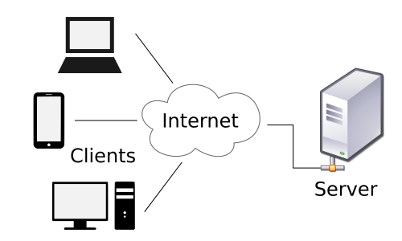

# The client/server model

The internet is a large network of computers. Not all computers have the same task: some are always available and serve information, others are only temporally available and will access information from others. This model is called the client/server model.

> The client/server model is a computing model that acts as a distributed application which partitions tasks or workloads between the providers of a resource or service, called servers, and service requesters, called clients.  Source: wikipedia

The client/server model is an asymmetric model. This means that not all participants (computers) in this model have the same task or responsibility. This is in contrast to the Peer-to-Peer or P2P model, where all participants have the same responsibility or task.

In the client/server model we have the servers that are always available. They only wait for requests and will never initiate the communication. The clients are only temporary active and initiates the communication.

## Client / browser

* **Requester** of a resource
* **Temporary** available
* Can only send **requests**
* Cannot respond
* Processes responses and displays them to the user

## Server

* **Provider** of a resource
* **Permanently** available
* Can only send **responses**
* Cannot request
* Generate responses for a specific request

## Requests and responses

The client always initiates the request. For example:

* `give me the website www.vives.be`

The server always responds to the request of the client:

* `Ok, here is the data/code for your request (www.vives.be)`
* `Sorry, I cannot find the data/code for your request`

