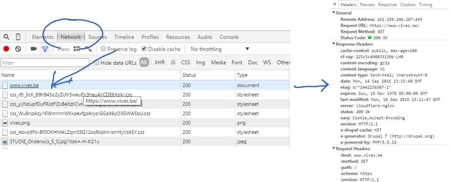
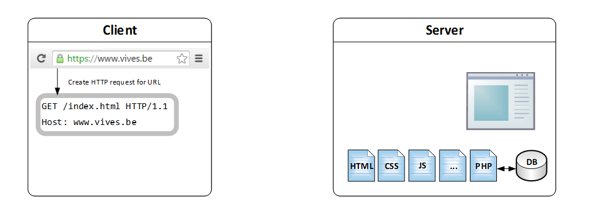
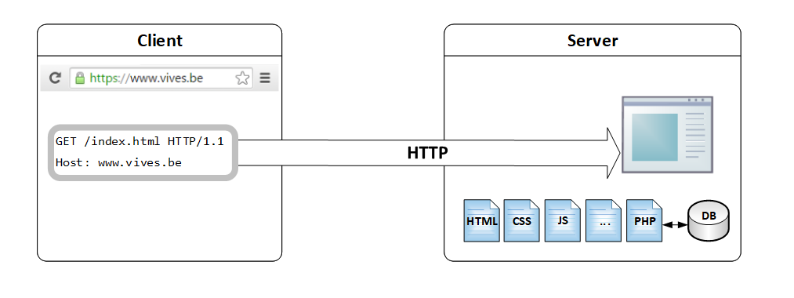
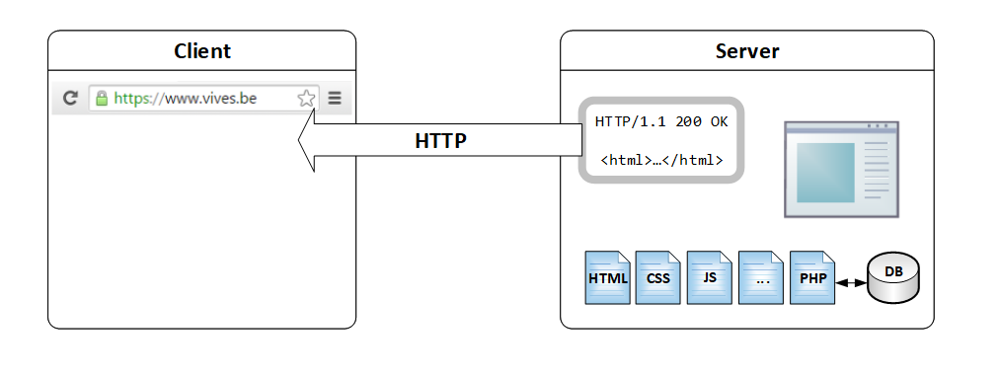
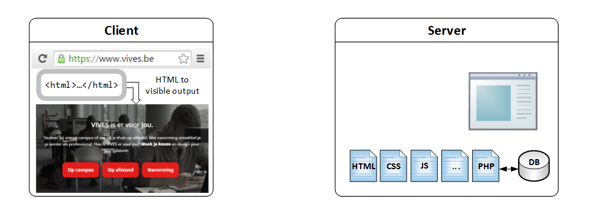

# Web protocols

## HTTP protocol

A protocol is a **system of rules** that allow two or more entities of a communications system to transmit information.

HTTP stands for HyperText Transfer Protocol. HTTP is a protocol that enables *client-server* applications. It defines how `requests` and `responds` should look and is standardized in the HTTP protocol coordinated by the IETF - Internet Engineering Task Force.


In the protocol, it is defined how **clients** can send *requests* and how **servers** should *respond*. The protocol consists out of plain text and is readable for humans. This makes debugging and understanding the process easy.

HTTP is build on top of the TCP/IP stack. By default, port `80` is reserved for HTTP. This is the standard port that is used when no port is provided. Any other port could be used as well, but must always be supplied when sending out requests using a browser or other software.

The HTTP protocol is a **stateless** protocol. This means that no information is shared between different requests or responses. Each request-response sequence is isolated. This enables HTTP servers to process requests and responses very efficiently and easy.

If some state must be retained, for example a user that logs in, HTTP *cookies* can be used to create the concept of sessions.

### Client request

The request message consists of the following:

* A request line: for example `GET /images/logo.png HTTP/1.1`, which requests a resource called `/images/logo.png` from the server.
* One or more request header fields (such as `Accept-Language: en`, …).
* An empty line to indicate the end of the header.
* An optional message body.

```http
GET / HTTP/1.1
Accept: */*
Accept-Encoding: gzip, deflate
Connection: keep-alive
Host: www.vives.be
User-Agent: HTTPie/0.9.2
```

::: warning 🔥WARNING
The `Host` header is mandatory, all others are optional.
::: 

### Server response

The response message consists of the following:

* A Status-Line which include the `status code` and `reason` message. For example `HTTP/1.1 200 OK` indicates that the client's request succeeded.
* Response header fields
    * such as `Content-Type: text/html`, …
* An empty line to indicate the end of the header
* An optional message body

```http
HTTP/1.1 200 OK
CF-RAY: 225c457079770300-LHR
Cache-Control: public, max-age=180
Connection: keep-alive
Content-Encoding: gzip
Content-Language: nl
Content-Type: text/html; charset=utf-8
Date: Mon, 14 Sep 2015 12:59:49 GMT
Etag: W/"1442235275-1"
Expires: Sun, 19 Nov 1978 05:00:00 GMT
Last-Modified: Mon, 14 Sep 2015 12:54:35 GMT
Server: cloudflare-nginx
Set-Cookie: __cfduid=d9cb1e5a7a171cd3e48723d5f9d669c721442235589; expires=Tue, 13-Sep-16 12:59:49 GMT; path=/; domain=.vives.be; HttpOnly
Transfer-Encoding: chunked
Vary: Cookie,Accept-Encoding
X-Drupal-Cache: HIT
X-Generator: Drupal 7 (http://drupal.org)
X-Powered-By: PHP/5.5.16

<html>….</html>
```

### Try it yourself

1. Open the developer tools in your browser.
2. Choose the 'Network' tab in the developer tools.
3. Visit a website, e.g. www.vives.be
4. Click on the initial request to view the details.

:::tip 💡Developer tools
* In Chrome (and most other browsers), the keybind is `F12`
* In Opera the keybind is `CRTL+SHIFT+i`
:::



## Getting documents over HTTP with clients and servers

Steps:
1. The user types the URL in the browser (client).
2. The browser translates the URL to a HTTP request.
3. The browser sends the HTTP request to the server.
4. The server generates a HTTP response containing the requested file:
    1. Find the requested file.
    2. Generate an HTTP response.
    3. Add the requested file to the HTTP response.
5. The server sends the HTTP response back to the client
6. The client processes the response and generates an output for the user

Illustrated example:

The user types the URL in the browser (client):


The browser translates the URL to a HTTP request:



The browser sends the HTTP request to the server:



The server generates a HTTP response containing the requested file:


The server sends the HTTP response back to the client:



The client processes the response and generates an output for the user:



> 🌐 Supporting learning material
>
> YouTube tutorial: [What Happens When You Click a Link?](https://www.youtube.com/watch?v=keo0dglCj7I)

## DNS - Domain Name System

> Domain Name System (DNS) is a hierarchical distributed naming system for computers, services, or any resource connected to the Internet 
<br>
Source: wikipedia

Translates domain names, which can be easily memorized by humans, to the numerical IP addresses needed for the purpose of computer services and devices worldwide.
`www.wikipedia.org --> 91.198.174.192`

