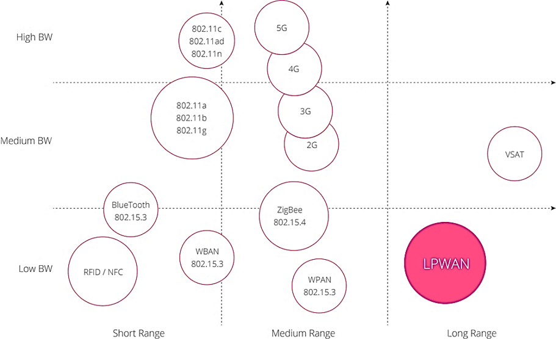

# IoT - Internet of Things

The Internet of Things (IoT) is a network of physical devices, vehicles, home appliances, and other items embedded with electronics, software, sensors, actuators, and connectivity. This technology enables these items to connect and exchange data. As a result, there are opportunities for more direct integration of the physical world into computer-based systems, leading to efficiency improvements, economic benefits, and reduced human exertion.

The number of IoT devices increased 31% year-over-year: from 8.4 billion in the year 2017 (now in 2024: +/- 17 billion devices) and it is estimated that there will be 30 billion devices by 2030. The global market value of IoT is projected to reach $715 billion by 2024.

IoT involves extending *Internet connectivity beyond standard devices*, such as desktops, laptops, smartphones and tablets, to any range of traditionally dumb or non-internet-enabled physical devices and everyday objects. Embedded with technology, these devices can communicate and interact over the internet, and they can be remotely monitored and controlled.

## IoT enables

Many technologies enable the IoT conept. This is a mix of existing technologies and newly rising technologies specific for IoT. Some examples are:

* Wireless technologies
    * 3G, 4G, 5G
    * Wifi
    * Bluetooth
    * LoRaWAN, Sigfox, NB-IoT
    * Zigbee, Z-Wave
* Communication protocols
    * MQTT
    * CoAP

**Overview of IoT enabling wireless technologies:**

<!--
y-as: bandbreedte, x-as: bereik

VSAT: Very small aperture terminal. Grondstation dat draadloos in verbinding staat met een communicatiesatelliet. Het grondstation gebruikt voor zenden en ontvangen is een kleine, meestal parabolische schotel. Typische toepassingen zijn:
- datacommunicatie van/naar verafgelegen gebruikers; dit kunnen gebruikers in afgelegen gebieden zijn, maar ook scheepvaart
- verspreiding van gegevens over veel gebruikers (broadcast).

LPWAN: Low Power Wide Area Network: is ontworpen om communicatie over lange afstanden met een lage bitsnelheid mogelijk te maken tussen IoT-apparaten , zoals sensoren die op een batterij werken.

WPAN: Wireless Personal Area Network: is een computernetwerk voor het verbinden van elektronische apparaten binnen de werkruimte van een individu. 

WBAN: Wireless Body Area Network: verbindt onafhankelijke knooppunten (bijvoorbeeld sensoren en actuatoren) die zich in de kleding, op het lichaam of onder de huid van een persoon bevinden. Het netwerk breidt zich doorgaans uit over het hele menselijk lichaam en de knooppunten zijn verbonden via een draadloos communicatiekanaal. Volgens de implementatie worden deze knooppunten in een ster- of multihoptopologie geplaatst.
-->