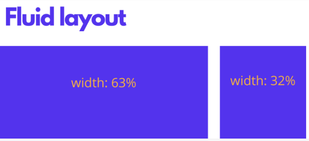
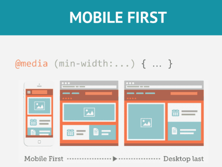
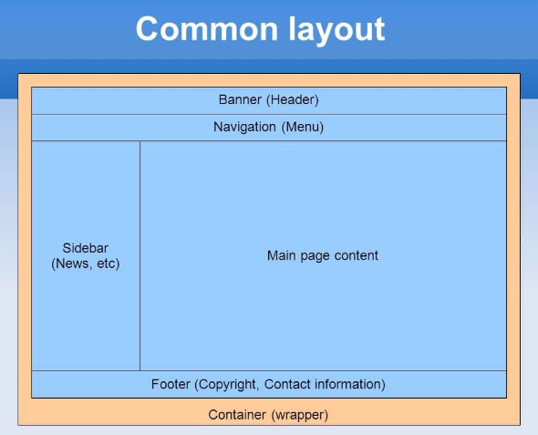

# Responsive styling

> 🌐 Supporting learning material
>
> YouTube tutorial: [The Beginner’s Guide to Responsive Web Design](https://www.youtube.com/watch?v=ACZgsnJIKxc)

Responsive design is a method within web design that ensures that your web content changes with the different sizes of screens of devices or windows on those devices.

For example, your content on a desktop screen can be split into different columns, since such a screen is wide enough to display multiple columns legibly.

But if you want to display the same content in multiple columns on a smartphone, this can make the content difficult to read for visitors.

Responsive design makes it possible to deliver different layouts of your content and associated design to different devices, depending on their screen size.

## The building blocks of responsive web design

In this section, we'll talk about the foundation of responsive web design and the different building blocks you need to do it.

### CSS and HTML

The basis for responsive design is the right combination of HTML and CSS

For example, you can adjust the width of all HTML images per element, like this:

```css
img {
   width: 100%;
}
```

Or we can target a specific class "full-width-img" by adding a dot beforehand.

```css
.full-width-img {
   width: 100%;
}
```

You can also edit the design on other aspects besides height, width and color. Using CSS in this way makes a design responsive when you combine it with a technique called "media query".

### Media queries

A media query checks which device is being used and is an important part of CSS3. It is the part with which you can display content depending on certain factors, such as screen size or resolution.


You can compare it to an "if" clause found in some programming languages, as it actually checks whether the visible portion of a screen is wide enough or too wide before executing a particular piece of code.

```css
@media screen and (min-width: 780px) {
   .full-width-img {
     margin: auto;
     width: 90%;
   }
}
```

If the screen is at least 780 pixels wide, images with the "full-width-img" class will use 90% of the screen and will be automatically centered in equal margins on both sides.

### Fluid layouts

A fluid layout is an essential part of modern responsive design. In the good old days you could set a static value for each HTML element, say 600 pixels.

However, a fluid layout depends on dynamic values, such as a percentage of the width of the screen.



This method dynamically resizes elements based on the size of the screen.

### Flexbox layouts

Although a percentage-based layout is seen as 'fluid', many designers and web developers do not yet find it dynamic or flexible enough. Flexbox is a CSS module designed as a more efficient way to arrange various elements in a layout, even when the size of a container's contents is unknown.

A flexible container adjusts the items in the container according to the available space. These flex containers have a number of unique properties, such as justify-content, that you cannot adjust with a normal HTML element.


This is quite advanced design. If you want to apply this in your design, we recommend that you read the [CSS Tricks' flexbox guide](https://css-tricks.com/snippets/css/a-guide-to-flexbox/).

### Responsive images

The most basic implementation of responsive images follows the same concept as fluid layout, where a dynamic unit is used to set the width or height. The piece of CSS code we mentioned earlier already takes care of this:

```css
img {
   width: 100%;
}
```

The % unit estimates a percentage of the width or height of the viewport and ensures that the image is proportioned to the screen.

The problem with this approach is that each user has to download the full size image, even on mobile devices.

To provide different versions for different devices, you need to include the HTML `srcset` attribute in your img tags so you can choose more than one image size.

```html

```

### Typical responsiveness limits

To work with media queries, you need to think about “responsive breakpoints” or screen size limits. A limit or breakpoint is the width of the screen on which you use a particular media query to implement new CSS styles.

### Common screen sizes

* Mobile: 360 x 640
* Mobile: 375 x 667
* Mobile: 360 x 720
* iPhone X: 375 x 812
* Pixel 2: 411 x 731
* Tablet: 768 x 1024
* Laptop: 1366 x 768
* High-res laptop or desktop: 1920 x 1080

If you choose a mobile-first approach, with one column and smaller fonts than the base layout, you don't need to implement mobile limits unless you want to optimize the design for specific models.



So you can create a simple responsive design with only two limits: one for tablets and one for laptops and desktops.

### This is how you make your website responsive

Now that you know the building blocks, it's time to make your website responsive.

#### Set the limits of your media query (responsive breakpoints)

Set the limits of your media query to the unique requirements of your design. For example, if you want to follow the Bootstap standard within your design, you will receive the following media queries:

* 576px for vertical phones
* 768px for tablets
* 992px for laptops
* 1200px for larger devices

#### Set the size of elements with percentages or create a CSS Grid layout

The first and most important step is to set different sizes for the different elements in the layout, depending on the media query or the size of the screen.

Of course, the number of layout containers you have will depend on your design, but most websites focus on the elements below:

* Wrapper or container
* Header
* Content
* Sidebar
* Footer



With a mobile-first approach, you can first style the most important elements in the layout (note: it does not contain a media query for the simplest style you use for a standard smartphone in normal mode):

```css
#wrapper { width:95%; margin: 0 auto; }
#header { width:100%; }
#content { width:100%; }
#sidebar { width:100%; }
#footer { width:100%; }

/* Small devices (landscape phones, 576px and up) */
@media (min-width: 576px) { ... }

/* Medium devices (tablets, 768px and up) */
@media (min width: 768px) {
   #wrapper { width:90%; margin: 0 auto; }
   #content { width:70%; float: left; }
   #sidebar { width:30%; float: right; }
}

/* Large devices (desktops, 992px and up) */
@media (min-width: 992px) { ... }

/* Extra large devices (large desktops, 1200px and up) */
@media (min width: 1200px) {
   #wrapper { width:90%; margin: 0 auto; }
}
```

If you prefer percentages, the “float” attribute controls on which side of the screen an element appears: left or right.

If you want to go beyond the basics and create a top-quality responsive design, you will need to master the CSS flexbox layout, including associated attributes such as box-sizing and flex.

#### Implement responsive images

One way to make sure nothing goes wrong with your images is to use a dynamic value for your image, as we saw earlier.

```css
img {
   width: 100%;
}
```

But with this you still ask quite a lot of mobile visitors when they visit your website.

Make sure you always use a `srcset` with different sizes of your images before adding images to your pages.

#### Responsive fonts for your website text

The main focus of responsive web design often focuses on the responsiveness of the layout blocks, elements, and media. Only afterwards do people (perhaps) think about the text again.

But if you really want good responsive design, you also have to adjust the size of your font so that it adapts to the screen size.

The easiest way to do this is to set a static value for the font size, such as 22 px, and adjust it for each media query.

You can target multiple text elements at once by using a comma to list elements.

```css
@media (min-width: 992px) {
   body, p, a, h4 {
     font-size: 14px;
   }
}
```

## Cross browser web design

The websites you create should look great and leave a strong impression on customers and users, whether they use Chrome, Edge, Opera, Safari or anything else.

Cross browser compatibility is an often overlooked step when creating a new website. Often the designers and developers use only one browser to create the site, and they may quickly check it on a handful of other browsers before they consider the project complete. This may suffice for simple sites that aren't business critical, but if you're building more complex sites, your site may look very different on other browsers.

Of course, testing every page on every different combination of device, platform, and browser is nearly impossible, and very costly. So how can we make sure that our site looks and behaves the way we want it to on as many browsers as possible?


### Enhance cross-browser compatibility

#### Don't repeat yourself

When developing code, you work with external files as much as possible for equal code and don't repeat the code over and over.
That way you only have to make adjustments in one place in case of problems.

#### Define a doctype

At the beginning of your HTML file(s), you define the language the code is written in so that browsers interpret it correctly. For example, in HTML5 the doctype declaration is simply:

```html
<!DOCTYPE html>
```

#### Validate your code

Wrong HTML and CSS code can cause your website to misbehave in different ways across all browsers. The bugs can be hard to spot and the web page will still typically build up with small, seemingly random issues which in turn make it difficult to debug.

One way to avoid this is to validate your code. You can validate [HTML](https://validator.w3.org) and [CSS](https://jigsaw.w3.org/css-validator) with the W3C validators, or install extensions in your IDE that check your code as you write it.

#### Use a CSS reset

By default, browsers can apply their own default styles to your website. Chrome, for example, applies a default margin to your page, which is small, but noticeable if you use a darker background color.

```css
/* CSS reset code */
html, body, div, span, applet, object, iframe,
h1, h2, h3, h4, h5, h6, p, blockquote, pre,
a, abbr, acronym, address, big, cite, code,
del, dfn, em, img, ins, kbd, q, s, samp,
small, strike, strong, sub, sup, tt, var,
b, u, i, center,
dl, dt, dd, ol, ul, li,
fieldset,form,label,legend,
table, caption, tbody, tfoot, thead, tr, th, td,
article, aside, canvas, details, embed,
figure, figcaption, footer, header, hgroup,
menu, nav, output, ruby, section, summary,
time, mark, audio, video {
   margin: 0;
   padding: 0;
   border: 0;
   font-size: 100%;
   font: inherit;
   vertical-align: baseline;
}
```

#### Check support for your CSS properties

Different browsers don't all support the same CSS properties (especially new ones), so what's perfectly usable in one browser may not exist in another. For example, the `backdrop-filter` property was initially only supported by Chrome and Edge and not by Firefox (note: it's now available in recent versions). If you rely on it, it will be unexpected behavior for your Firefox users.

Tools like [Can I Use](https://caniuse.com) allow you to check CSS properties for their browser support. This means you won't waste a lot of time designing with a poorly supported property only to have to redevelop it later.

#### Create responsive websites

Responsive web design ensures that the design adapts to any device it can be viewed on, from desktop to mobile and everything in between. It is important to ensure that all functionality is possible and that all information is accessible on any device and browser, regardless of size.

#### Provide alternatives

There may be cases where we cannot avoid using a feature that is not fully supported by other browsers. In that case it may be necessary to provide an alternative file for specific browsers. For example:

```html
<link href="styles.css" rel="stylesheet"/>
<!--[if lte IE 8]>
  <link href=”ie-styles.css” rel=”stylesheet”/>
<![endif]-->
```

#### Take advantage of cloud-based browser testing

In an ideal world, you would be able to personally test your website on many different devices and browsers. But in smaller teams this may not be possible, so you might want to look into cloud-based browser tests where your website can run on many different combinations of browsers at the same time. [LambdaTest](https://www.lambdatest.com/), [BrowserStack](https://www.browserstack.com/) and [SmartBear](https://smartbear.com/ppc/testcomplete/web-testing/) all provide the ability to test cross-browser compatibility quickly and efficiently. These websites require an account and are unfortunately not free (though they offer a free trial period).