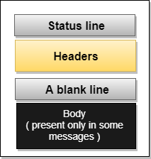
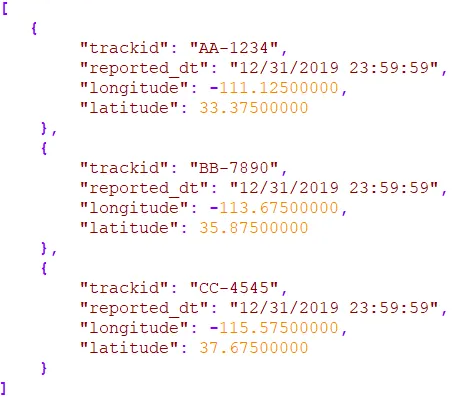

# Communication 

Let's take a closer look at some of the communication protocols used in communication over the web.

## Uniform Resource Locator - URL

Uniform Resource Locators or short URLs are standardized names for internet resources. URLs point to pieces of information and tells two things about that piece of information.

* Telling where they are located
* How to interact with them

As you can see, a URL can exist out of several parts:

* **Scheme**: it tells the client how to access the resource. The URL says to use the HTTP protocol
* **Userinfo**: Login credentials user. For obvious reasons nog realy used.
* **Host**: is the server location, telling where the resource is hosted, in this case the host or server is called
* **Port**: on what TCP port to connect to on the host (server). This defaults to port 80 if omitted*
* **Resource path**: it tells what local resource on the server is being requested. 
* **Query**: queries can be used to filter down the resource. The query is prefixed by the ? character.
* **Fragment**: can be used to identify a single piece within the resource. The fragment is prefixed by the # character

### Absolute versus relative URL

Web clients (browsers) understand a few shortcuts.
Relative URLs are a shorthand for specifying a resource within a resource URL’s can be absolute or relative.
* An absolute URL contains all the information to access a resource.
* A relative URL is incomplete. To get all the information it must interpret it relative to another URL, called the base.
Relative URLs are relative to the document in which it is found.

|Relative URL | Example  |
|- | - |
| Same folder | `reviews.html` |
| Child folder | `music/listings.html` |
| Grandchild folder | `movies/dvd/reviews.html` |
| Parent folder | `../index.html` |
| Grandparent folder | `../../index.html` |

## Hypertext Transfert Protocol - HTTP

HTTP is a protocol to access the data on the World Wide Web. It can be used to transfer the data in the form of text, audio, video, and so on and uses a MIME-like format.

### Features

* **Connectionless protocol**: HTTP is a connectionless protocol. HTTP client initiates a request and waits for a response from the server. When the server receives the request, the server processes the request and sends back the response to the HTTP client after which the client disconnects the connection. The connection between client and server exist only during the current request and response time only.
* **Media independent**: HTTP protocol is a media independent as data can be sent as long as both the client and server know how to handle the data content. It is required for both the client and server to specify the content type in MIME-type header.
* **Stateless**: HTTP is a stateless protocol as both the client and server know each other only during the current request. Due to this nature of the protocol, both the client and server do not retain the information between various requests of the web pages.

### Messages

**Request Message**: The request message is sent by the client that consists of a request line, headers, and sometimes a body.

 

Frequently used HTTP Requests are GET, POST, DELETE.

**Response Message**: The response message is sent by the server to the client that consists of a status line, headers, and sometimes a body.

The server always sends a response status code:

* 1xx : Informational
* 2xx : Succes
* 3xx : Redirection
* 4xx : Client error
* 5xx : Server error

## Domain Name System - DNS

A DNS server is a computer with a database containing the public IP addresses associated with the names of the websites an IP address brings a user to. DNS acts like a phonebook for the internet. Whenever people type domain names, like vives.be or google.be, into the address bar of web browsers, the DNS finds the right IP address. The site’s IP address is what directs the device to go to the correct place to access the site’s data.

Once the DNS server finds the correct IP address, browsers take the address and use it to send data to content delivery network (CDN) edge servers or origin servers. Once this is done, the information on the website can be accessed by the user. The DNS server starts the process by finding the corresponding IP address for a website’s uniform resource locator (URL).

## JavaScript Object Notation - JSON

JSON is a text-based data format following JavaScript object syntax. Even though it closely resembles JavaScript object literal syntax, it can be used independently from JavaScript, and many programming environments feature the ability to read and generate JSON.

This format is typicaly used in REST-API applications.

**Example**

## Message Queuing Telemetry Transport - MQTT

MQTT is a standards-based messaging protocol, or set of rules, used for **machine-to-machine communication**. Smart sensors, wearables, and other Internet of Things (IoT) devices typically have to transmit and receive data over a resource-constrained network with limited bandwidth. These IoT devices use MQTT for data transmission, as it is easy to implement and can communicate IoT data efficiently. MQTT supports messaging between devices to the cloud and the cloud to the device.

### Why is the MQTT protocol important?

The MQTT protocol has become a standard for IoT data transmission because it delivers the following benefits:

* **Lightweight and efficient**: MQTT implementation on the IoT device requires minimal resources, so it can even be used on small microcontrollers. For example, a minimal MQTT control message can be as little as two data bytes. MQTT message headers are also small so that you can optimize network bandwidth.

* **Scalable**: MQTT implementation requires a minimal amount of code that consumes very little power in operations. The protocol also has built-in features to support communication with a large number of IoT devices. Hence, you can implement the MQTT protocol to connect with millions of these devices.

* **Reliable**: Many IoT devices connect over unreliable cellular networks with low bandwidth and high latency. MQTT has built-in features that reduce the time the IoT device takes to reconnect with the cloud. It also defines three different quality-of-service levels to ensure reliability for IoT use cases— at most once (0), at least once (1), and exactly once (2).

* **Secure**: MQTT makes it easy for developers to encrypt messages and authenticate devices and users using modern authentication protocols, such as OAuth, TLS1.3, Customer Managed Certificates, and more.

* **Well-supported**: Several languages like Python, JavaScript, Node,... have extensive support for MQTT protocol implementation. Hence, developers can quickly implement it with minimal coding in any type of application.