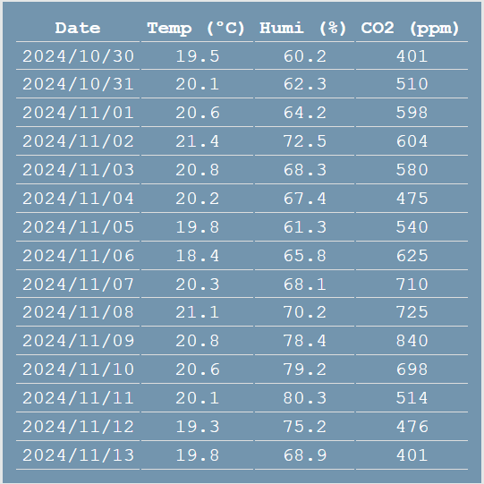

# Using API's in JavaScript

An API is a service that enables a company to make data available without having access to the actual database.
It is also used as the service that links a frontend to a backend, you will learn this later on.

For now we will be using public API's. For some of them you will need to register so you get an **API key** or **token** that you can use to identify yourself with each request. Good API services always have a good documentation where you can find how you should send your request and what the JSON data scheme will be of the response.

:::warning 🔥Warning
Always look if an API service is free or behind a payment plan.
:::

## Example 1: using a public API

We will be making a webpage (no styling) with a button that receives data on your internet connection from the API `ipinfo.io` and displays it on the page.

For this we use a `index.html` file with the following content:

```html
<!DOCTYPE html>
<html lang="en">
<head>
    <meta charset="UTF-8">
    <meta http-equiv="X-UA-Compatible" content="IE=edge">
    <meta name="viewport" content="width=device-width, initial-scale=1.0">
    <title>Example 1: using a public API</title>
    <script src="resources/js/script.js"></script>
</head>
<body>
    <button id="buttonIp">Get my ip address</button>
    <p id="ip"></p>
    <p id="isp"></p>    
    <p id="coordinates"></p>
</body>
</html>
```

In JavaScript we now need a `getIp` function, this function needs to be `async` because we have to wait for the response of the API service.

To make that request we use the JavaScript `fetch` function with the URL as parameter:

```js
let response = await fetch("https://ipinfo.io/json?token=<your-token>");
```

We need the `await` because we need to wait for the response and don't want to freeze the application.
The response we get from an API is always a JSON format as a string, so to handle the data better we need to convert this to a JSON object:

```js
let ipInfo = await response.json();
```

Finally we use the received info to populate the `<p>` in HTML :

```js
window.addEventListener("DOMContentLoaded", () => 
{
    document.getElementById("buttonIp").addEventListener("click", getIp);
});

async function getIp(){
    let response = await fetch("https://ipinfo.io/json?token=<your-token>");
    let ipInfo = await response.json();
    console.log(ipInfo);
    document.getElementById("ip").textContent=`Your ip address is ${ipInfo.ip} [${ipInfo.hostname}]`;
    document.getElementById("isp").textContent=`Your internet service provider is ${ipInfo.org}`;    
    document.getElementById("coordinates").textContent=`Your local connnection has coordinates ${ipInfo.loc}`;
}
```

## Example 2: using a JSON file that represents a response from an API

For this example we will use a JSON file containing the response data from an API.

Once the HTML structure is loaded we will start a function `getData` to retrieve the data and populate the page:

```js
window.addEventListener("DOMContentLoaded", getData);
```

To receive the data we follow the same strategy as before, but the URL is in fact a path to a file:

```js
let response = await fetch("resources/data/apisim.json");
let json = await response.json();
```

Next we will be converting the values of the data to an array to make it easier to iterate:

```js
let inputValues = Object.values(json.Data);
```

Before populating a table with the data we make sure no previous data is still present in the table:

```js
let tbody = document.getElementById("tableBody");
while (tbody.hasChildNodes()) {
    tbody.removeChild(tbody.firstChild);
}
```

To populate the table we will be iterating through the values:

```js
inputValues.forEach((data) => {

}
```
Now we need to append a new row with the cells containing the data:

```js
// adding a new row to the table body
let row = tbody.insertRow(-1);

// adding a new cell to the newly made row
let cell = row.insertCell(-1);

// creating a textnode containing the actual data
let date = document.createTextNode(data.Date);

// appending the textnode to the newly made cell
cell.appendChild(date);
```

Continue adding cells for all the data such as temperature, humidity and CO2.

The result should look like this:



Now that the data is visible in the table, we want to visualize it also in a graph. For this we will use **Google Charts**.

First have a look at the documentation on the [line chart from Google Charts](https://developers.google.com/chart/interactive/docs/gallery/linechart) and try this out.

Based on the example "Creating Material Line Charts" on Google Charts we write our own script.

First we load the visualization API and the *Line package* and set the callback function to run when the API is loaded.

```js
google.charts.load("current", {"packages":["line"]});
google.charts.setOnLoadCallback(function () {
    
});
```

In the callback function we write the following code:

```js
        // create data columns
        let data = new google.visualization.DataTable();
        data.addColumn("date", "Date");
        data.addColumn("number", "Temp (°C)");
        data.addColumn("number", "Humi (%)");
        data.addColumn("number", "CO2 (ppm)");

        // add the data in rows by iterating through the values
        inputValues.forEach((dataRecord) => {
            data.addRow([new Date(dataRecord.Date), parseFloat(dataRecord.Temp), parseFloat(dataRecord.Humi), parseFloat(dataRecord.CO2)]);
        });

        // set the graph options
        let options = {
            chart: { title: "History graph", },
            width: "100%",
            height: 690,
            series: { 0: { axis: "Data" } },
            hAxis: { format: "d/M/yy", gridlines: { count: 15 } },
            axes: {
                y: {
                    temp: { label: "Temp (°C)" },
                    humi: { label: "Humi (%)" },
                    co2: { label: "CO2 (ppm)" }
                }
            },
            legend: { position: "none" }
        };
        
        // instantiate and draw our chart, passing in the options.
        let chart = new google.charts.Line(document.getElementById("chart"));
        chart.draw(data, google.charts.Line.convertOptions(options));
```

The result should look like this:


You can, of course, add more formatting and styling, such as displaying a legend, titles, colors, etc. Read the documentation for further details.

<br>
The complete code examples (example 1 and 2) will be available on Toledo.